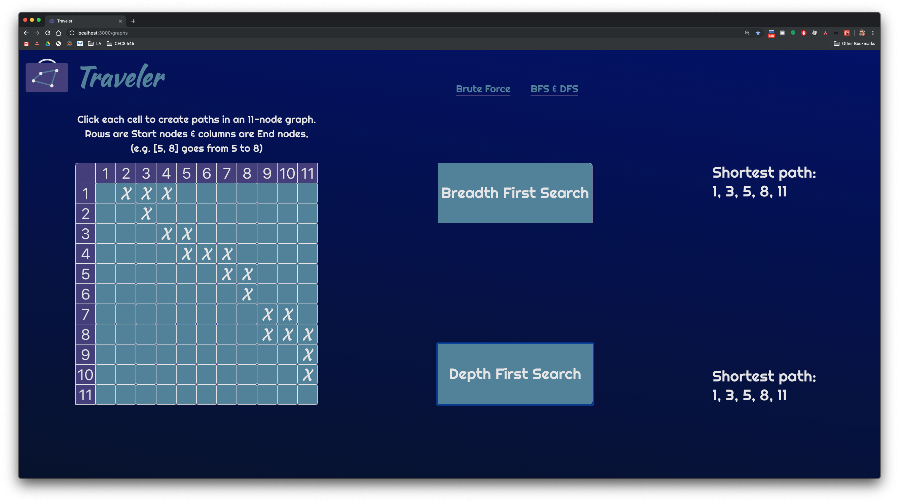
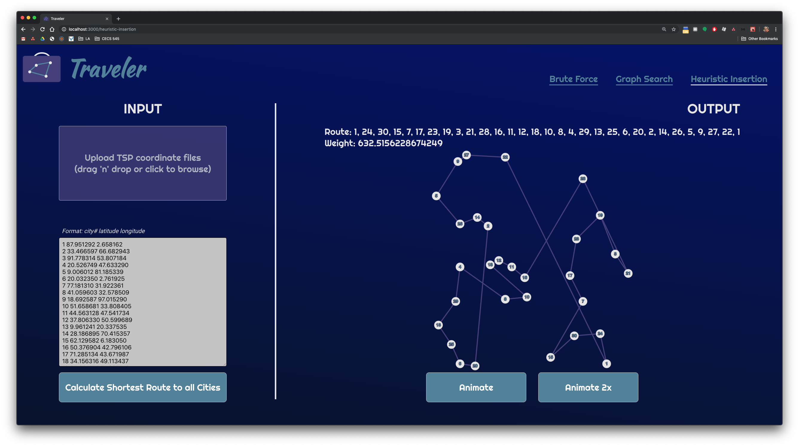

# Traveler
Solving the traveling salesperson problem with brute force, breadth-first search, depth-first search, heuristic insertion, genetic algorithms, and wisdom of the crowd.
## Dependencies
`java 12`
## Run
Download the `artifact/project1-0.0.1-SNAPSHOT.jar` then run:
```$xslt
java -jar project1-0.0.1-SNAPSHOT.jar
```
Open `Chrome` and navigate to [localhost:8080](http://localhost:8080)

## Installation
Clone the project and run the server:
```$xslt
cd {project-dir}
mvn install
mvn spring-boot:run
```
Open `Chrome` and navigate to [localhost:8080](http://localhost:8080)
## Usage
I designed this application with `Chrome` users in mind. While the site itself guides you through its use, keep in mind that it does not take file uploads–-you must copy/paste your city coordinates from the TSP text files. Here is what you can expect to see when the application runs properly. 

  
### Brute Force

*Beware: 12-city routes take nearly 2 minutes to calculate on a machine with 32GB of memory.

### BFS & DFS


### Heuristic Insertion


